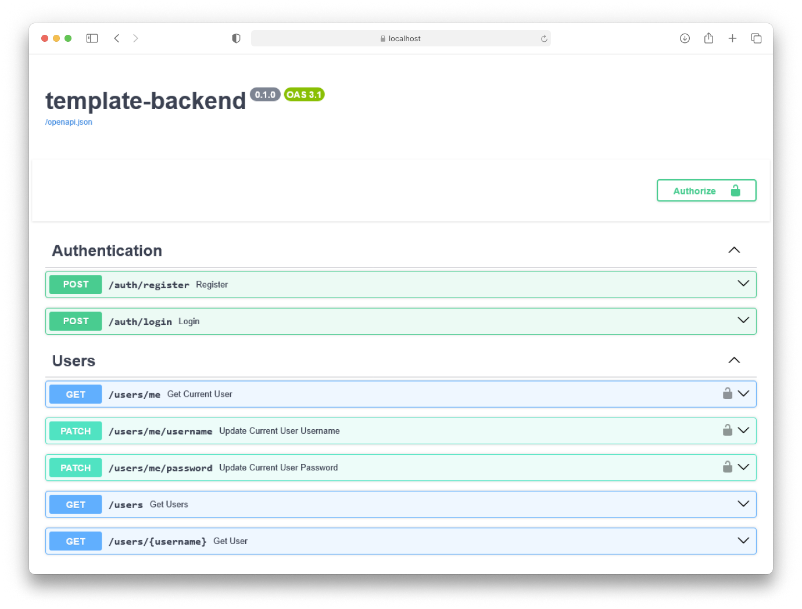
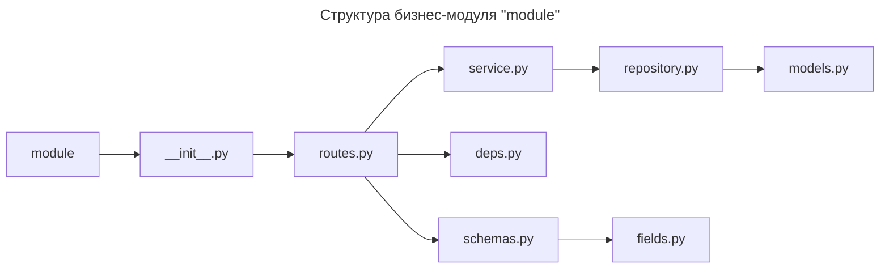
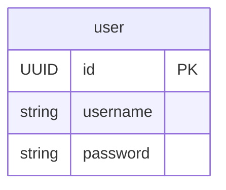

[](https://www.python.org)
[](https://pycodestyle.pycqa.org)
[](https://www.conventionalcommits.org)

# template-backend



Данный шаблон предоставляет базовый функционал для создания приложения с помощью FastAPI.

**Основные особенности:**

- JWT авторизация — безопасный способ аутентификации пользователей.
- Docker — использование `Dockerfile` и `docker compose` для контейнеризации приложения.
- Конфигурация — взаимодействие с переменными окружения через [pydantic_settings](https://docs.pydantic.dev/latest/concepts/pydantic_settings/).
- Типизирование — статическая проверка типизирования с использованием [pyright](https://github.com/microsoft/pyright/).
- Форматирование кода — автоматическое форматирование с помощью [ruff](https://docs.astral.sh/ruff/).
- Линтинг кода — проверка кода на соответствие стандартам с использованием [ruff](https://docs.astral.sh/ruff/).
- Тестирование — написание и выполнение тестов с помощью [pytest](https://pytest.org/) через [docker](https://www.docker.com/).
- Файловое хранилище — интеграция с S3-Yandex Cloud хранилищем через [boto3](https://boto3.amazonaws.com/v1/documentation/api/latest/index.html).

# Архитектура

## Структура бизнес-модулей

Каждый бизнес-модуль отражает конкретную функциональность, такую как управление пользователями или аутентификация.

```tree
module
├── __init__.py       # файл инициализации, импортирующий роутер
├── deps.py           # настройки зависимостей бизнес-модуля
├── fields.py         # переиспользуемые поля для схем
├── models.py         # модели базы данных
├── repository.py     # доступ к данным и операции CRUD
├── routes.py         # маршруты бизнес-модуля
├── schemas.py        # схемы для валидации данных
└── service.py        # сервисы с бизнес-логикой модуля
```

Импорты внутри модуля должны выглядеть следующим образом для избежания круговых зависимостей:



> При необходимости могут быть введены собственные под-модули исходя из бизнес требований.

## Схема базы данных



## S3 storage

В проект заложена основа для работы с хранилищем типа S3. Используется Yandex Cloud S3 хранилище.

Настройка доступа к хранилищу конфигурируется следующими переменными окружения:

```properties
YANDEX_S3_KEY=your-secret-key
YANDEX_S3_KEY_ID=your-secret-key-id
YANDEX_S3_BUCKET=bucket-name
```

# Разработка

Работайте в отдельных ветках, чтобы не испортить главную ветку.

**Префиксы для веток:**

- `feat/*` — для новой функциональности.
- `test/*` — для тестирования.

Следуя этой структуре, вы сможете легко организовать и отслеживать изменения в проекте.

## Начало

### Шаг 1 — склонируйте репозиторий

Склонируйте репозиторий командой (предварительно настроив SSH-ключи):

```bash
git clone git@gitlab.com:prodcontest/template-backend.git
```

### Шаг 2 — установите зависимости

Для управления зависимостями в проекте используется пакетный менеджер [pip](https://pip.pypa.io).

Зависимости организованы следующим образом:

```tree
requirements
├── common.txt  # общие зависимости
├── dev.txt     # зависимости для разработки
└── prod.txt    # зависимости для продакшена
```

Чтобы установить нужную группу зависимостей, выполните одну из команд ниже:

```bash
pip install -r requirements/dev.txt
```

```bash
pip install -r requirements/prod.txt
```

### Шаг 3 — настройте окружение

Для запуска приложения через docker достаточно скопировать пример файла конфигурации окружения:

```bash
cp .env.example .env
```

После выполнения этой команды у вас будет создан файл `.env`, который содержит все необходимые переменные окружения.

## Типизация

В проекте используется строгое статическое типизирование с помощью pyright, и для проверки типов необходимо выполнить:

```bash
pyright
```

## Форматирование

Для поддержания единого код-стиля используйте форматер:

```bash
ruff format
```

## Линтинг

Чтобы проверить код на соответствие стандартам проекта и автоматически исправить проблемы, выполните:

```bash
ruff check --fix
```

# Тестирование

Тесты запускаются в докере для полной изоляции.

Для запуска контейнера с тестами выполните следующую команду:

```bash
docker compose --profile test up --build --abort-on-container-exit
```

Для удаления контейнеров с тестами используйте:

```bash
docker compose --profile test down -v
```

# Развёртывание

Для запуска контейнера с приложением выполните следующую команду:

```bash
docker compose --profile prod up -d --build
```

Для остановки контейнера обязательно указывайте профиль:

```bash
docker compose --profile prod down -v
```
